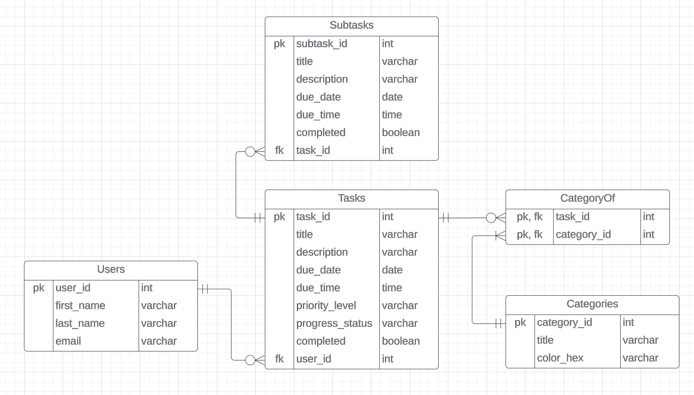

# Entity Relationship Diagram

Reference the Creating an Entity Relationship Diagram final project guide in the course portal for more information about how to complete this deliverable.

## Tables and Relationships

 - **Users**
    - Each user can have zero, one, or many tasks. Each task is owned by one user.
 - **Tasks**
    - Each task can have zero, one, or many categories. 
    - Each task can have zero, one, or many subtasks. 
 - **Categories**
    - Each category is related to one or many tasks.
 - **Subtasks**
    - Each subtask is the subtask of one task.

## Add the Entity Relationship Diagram

