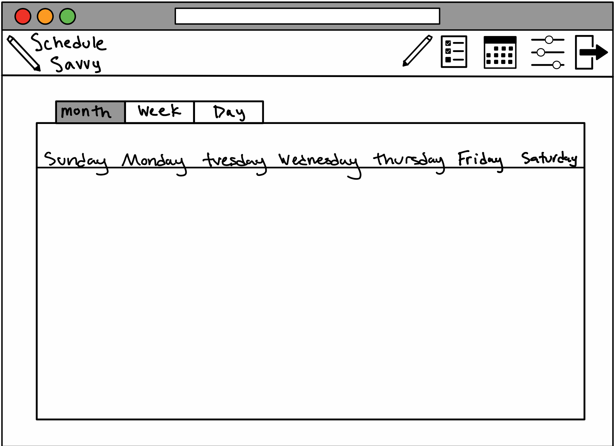

# Wireframes

Reference the Creating an Entity Relationship Diagram final project guide in the course portal for more information about how to complete this deliverable.

## List of Pages

- Login pages ⭐
- Sign in page ⭐
- Create Task page ⭐
- Tasks page ⭐
- Calender page ⭐
- Settings  

## Wireframe 1: Login Page

## Wireframe 2: Sign in Page

## Wireframe 3: Create Task Page

## Wireframe 4: Tasks page

## Wireframe 5: Calendar page

